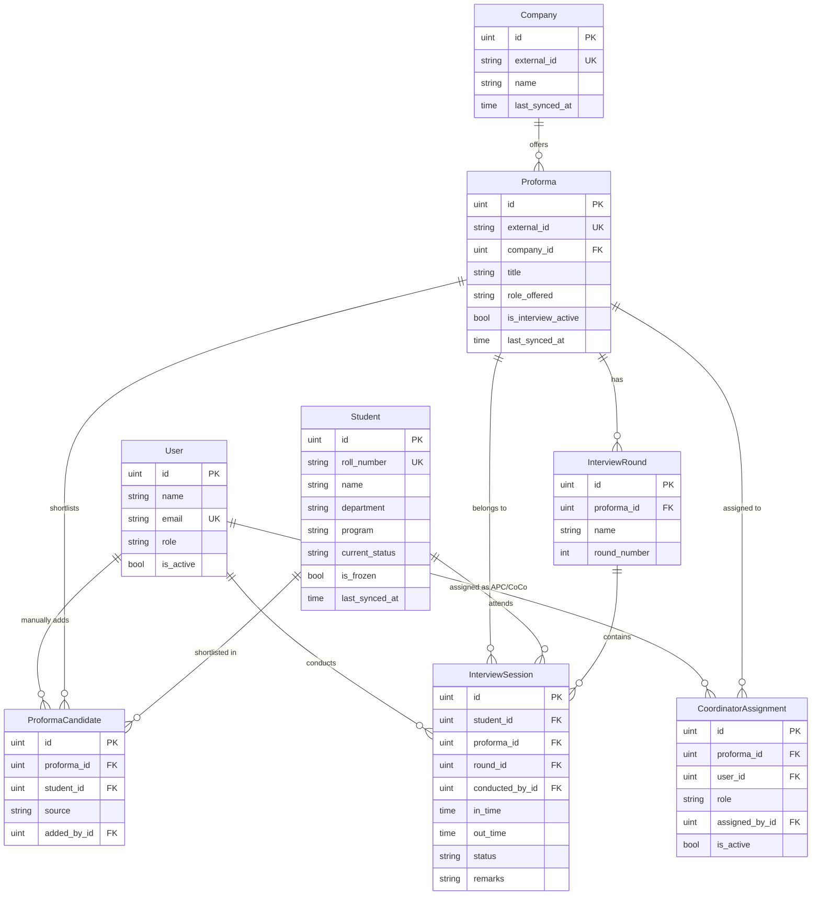

# PIMS — Database Schema Design

> **Database:** PostgreSQL · **ORM:** GORM (Go) · **Module:** `github.com/spo-iitk/Magicsheet-backend`

---

## Table of Contents

1. [Entity-Relationship Overview](#entity-relationship-overview)
2. [Design Philosophy](#design-philosophy)
3. [Schema Models](#schema-models)
   - [User](#1-user)
   - [Company](#2-company)
   - [Proforma](#3-proforma)
   - [Student](#4-student)
   - [ProformaCandidate](#5-proformacandidate)
   - [InterviewRound](#6-interviewround)
   - [InterviewSession](#7-interviewsession)
   - [CoordinatorAssignment](#8-coordinatorassignment)
   - [SyncLog](#9-synclog)
4. [Custom Types & Constants](#custom-types--constants)
5. [Index Strategy](#index-strategy)
6. [Constraint Summary](#constraint-summary)
7. [Global Availability Engine — How It Works](#global-availability-engine--how-it-works)
8. [AutoMigrate Registration](#automigrate-registration)

---

## Entity-Relationship Overview



---

## Design Philosophy

### Why these decisions were made

| Decision | Rationale |
|----------|-----------|
| **Synced entities carry `external_id` + `last_synced_at`** | Company, Proforma, and Student are not created inside PIMS — they originate from the central placement portal. `external_id` is the portal's primary key so we can upsert on sync. `last_synced_at` lets us detect stale records and trigger re-syncs. |
| **`Student.current_status` is denormalized** | The Global Availability Engine needs sub-second answers to "Is this student free right now?" across potentially hundreds of concurrent CoCo queries. Deriving status by scanning `interview_sessions` on every request would be expensive. Instead, we maintain a denormalized status column that is updated **transactionally** whenever an interview IN/OUT time is recorded. |
| **`Student.is_frozen` is a separate boolean** | Frozen is not an interview state — it's an external administrative flag from the central portal. Keeping it separate from `current_status` avoids conflating two orthogonal concerns. A student can be `available` **and** `frozen` (meaning they're not in any interview but still blocked from participating). |
| **`ProformaCandidate` is a first-class entity, not a plain junction table** | It carries `source` (synced vs manual) and `added_by_id` for audit. This distinction is critical because the system explicitly supports two shortlist paths — automated sync and manual CoCo entry. The audit trail tells you *who* added *which* student and *how*. |
| **`InterviewRound` is a separate table, not an enum on session** | Rounds are ordered, named, and proforma-specific. Different companies may have 2 rounds or 7 rounds. Storing round metadata in its own table allows dynamic round creation while maintaining ordering through `round_number`. |
| **`CoordinatorAssignment` tracks role + `assigned_by`** | The spec defines a strict hierarchy: OPC → APC → CoCo. Rather than two separate assignment tables, a single table with a `role` discriminator captures both APC-to-proforma and CoCo-to-proforma assignments. `assigned_by_id` provides the audit trail the SPO requires. |
| **`InterviewSession.proforma_id` is stored alongside `round_id`** | This is intentional denormalization. Yes, you could derive `proforma_id` from `round.proforma_id`, but interview sessions are the most queried entity in the system — dashboards, availability checks, conflict detection all hit this table. Having `proforma_id` directly avoids a JOIN on every hot path. |
| **Soft deletes on User/Company/Proforma/Student only** | Operational entities like `InterviewSession` and `CoordinatorAssignment` should never be deleted — they're audit records. Synced entities might need soft deletion if they're removed from the portal. Users might be deactivated. |
| **`SyncLog` table** | Provides observability into the sync pipeline. When sync fails at 2 AM during placement season, the OPC needs to see exactly what happened, when, and which records were affected. |

---

## Schema Models

### 1. User

> System users: OPC, APC, and CoCo. Authentication is handled externally (JWT is already in `go.mod`). This table stores identity and role information.

```go
type User struct {
    ID        uint           `gorm:"primaryKey"                                    json:"id"`
    CreatedAt time.Time      `                                                     json:"created_at"`
    UpdatedAt time.Time      `                                                     json:"updated_at"`
    DeletedAt gorm.DeletedAt `gorm:"index"                                         json:"-"`

    Name     string   `gorm:"type:varchar(150);not null"                           json:"name"`
    Email    string   `gorm:"type:varchar(255);uniqueIndex:idx_user_email;not null" json:"email"`
    Role     UserRole `gorm:"type:varchar(20);not null;index:idx_user_role"         json:"role"`
    Phone    string   `gorm:"type:varchar(20)"                                     json:"phone"`
    IsActive bool     `gorm:"default:true;not null"                                json:"is_active"`

    // Reverse relations (not stored, loaded via Preload)
    Assignments []CoordinatorAssignment `gorm:"foreignKey:UserID" json:"assignments,omitempty"`
}
```

**Why these choices:**

| Field | Reasoning |
|-------|-----------|
| `Email` with unique index | Every SPO member has an institute email. This is the login identifier — it must be unique. |
| `Role` as `varchar(20)` with index | PostgreSQL enums are hard to migrate (adding/removing values requires DDL). A constrained varchar with an application-level type is safer and equally fast with an index. The index lets us quickly query "give me all APCs" for assignment dropdowns. |
| `IsActive` instead of hard delete | Coordinators change across placement seasons. Deactivating preserves the audit trail (their name still appears in historical assignments and interview sessions). |
| `Phone` nullable | Not every coordinator provides a phone number during initial setup. |
| `DeletedAt` (soft delete) | Supports GORM's soft-delete pattern. Queries automatically exclude soft-deleted records. The `index` on `DeletedAt` ensures soft-delete filtering doesn't degrade scan performance. |

---

### 2. Company

> Synced from the central placement portal. PIMS never creates companies — it only reads and references them.

```go
type Company struct {
    ID        uint           `gorm:"primaryKey"                                         json:"id"`
    CreatedAt time.Time      `                                                          json:"created_at"`
    UpdatedAt time.Time      `                                                          json:"updated_at"`
    DeletedAt gorm.DeletedAt `gorm:"index"                                              json:"-"`

    ExternalID   string    `gorm:"type:varchar(100);uniqueIndex:idx_company_ext;not null" json:"external_id"`
    Name         string    `gorm:"type:varchar(255);not null"                             json:"name"`
    Industry     string    `gorm:"type:varchar(150)"                                      json:"industry"`
    Website      string    `gorm:"type:varchar(500)"                                      json:"website"`
    LogoURL      string    `gorm:"type:varchar(500)"                                      json:"logo_url"`
    LastSyncedAt time.Time `gorm:"not null;index:idx_company_sync"                        json:"last_synced_at"`

    // Reverse relation
    Proformas []Proforma `gorm:"foreignKey:CompanyID" json:"proformas,omitempty"`
}
```

**Why these choices:**

| Field | Reasoning |
|-------|-----------|
| `ExternalID` (unique) | The portal's primary key. On every sync, we `ON CONFLICT (external_id) DO UPDATE` to upsert. Without this, we'd create duplicates on every sync cycle. |
| `LastSyncedAt` (indexed) | Allows queries like "which companies haven't synced in the last 24 hours?" — critical for monitoring sync health. The index makes this scan fast even with thousands of companies. |
| `Industry`, `Website`, `LogoURL` all nullable | These are supplementary fields from the portal. They may or may not be populated depending on the company's portal profile. We don't want to block sync for missing optional data. |
| No `is_active` flag | Unlike users, companies are managed externally. If a company is removed from the portal, soft delete handles it on the next sync. |

---

### 3. Proforma

> A recruitment opportunity offered by a company. Synced from the portal. The `IsInterviewActive` flag is the OPC's control switch — nothing happens in PIMS for a proforma until this is set to `true`.

```go
type Proforma struct {
    ID        uint           `gorm:"primaryKey"                                            json:"id"`
    CreatedAt time.Time      `                                                             json:"created_at"`
    UpdatedAt time.Time      `                                                             json:"updated_at"`
    DeletedAt gorm.DeletedAt `gorm:"index"                                                 json:"-"`

    ExternalID        string    `gorm:"type:varchar(100);uniqueIndex:idx_proforma_ext;not null" json:"external_id"`
    CompanyID         uint      `gorm:"not null;index:idx_proforma_company"                     json:"company_id"`
    Company           Company   `gorm:"constraint:OnDelete:RESTRICT"                            json:"company,omitempty"`
    Title             string    `gorm:"type:varchar(255);not null"                              json:"title"`
    RoleOffered       string    `gorm:"type:varchar(255)"                                       json:"role_offered"`
    Description       string    `gorm:"type:text"                                               json:"description"`
    ProformaType      string    `gorm:"type:varchar(50);index:idx_proforma_type"                json:"proforma_type"` // intern, fte, etc.
    IsInterviewActive bool      `gorm:"default:false;not null;index:idx_proforma_active"        json:"is_interview_active"`
    LastSyncedAt      time.Time `gorm:"not null"                                                json:"last_synced_at"`

    // Reverse relations
    Candidates      []ProformaCandidate     `gorm:"foreignKey:ProformaID" json:"candidates,omitempty"`
    InterviewRounds []InterviewRound         `gorm:"foreignKey:ProformaID" json:"interview_rounds,omitempty"`
    Assignments     []CoordinatorAssignment  `gorm:"foreignKey:ProformaID" json:"assignments,omitempty"`
}
```

**Why these choices:**

| Field | Reasoning |
|-------|-----------|
| `CompanyID` + `OnDelete:RESTRICT` | A proforma **must** belong to a company. `RESTRICT` prevents accidentally deleting a company that still has active proformas — the OPC must explicitly clean up proformas first. This is a deliberate data-integrity safeguard. |
| `IsInterviewActive` (indexed) | This is the OPC's master switch. Dashboard queries filter on this constantly: "show me all active proformas". Without the index, every dashboard load would full-scan the proformas table. |
| `ProformaType` | Distinguishes intern vs full-time vs other placement types. Indexed because APCs commonly filter by type. |
| `RoleOffered` vs `Title` | `Title` is the proforma's portal title (e.g., "Google SDE Intern 2026"). `RoleOffered` is the specific job role (e.g., "Software Development Engineer"). They serve different purposes in the UI. |
| `Description` as `text` | Job descriptions can be lengthy. `text` has no length limit in PostgreSQL, unlike `varchar(n)`. |

---

### 4. Student

> Synced from the central SPO database. Also fetchable on-demand via roll number lookup when CoCos manually add candidates.

```go
type Student struct {
    ID        uint           `gorm:"primaryKey"                                              json:"id"`
    CreatedAt time.Time      `                                                               json:"created_at"`
    UpdatedAt time.Time      `                                                               json:"updated_at"`
    DeletedAt gorm.DeletedAt `gorm:"index"                                                   json:"-"`

    RollNumber    string        `gorm:"type:varchar(50);uniqueIndex:idx_student_roll;not null"   json:"roll_number"`
    Name          string        `gorm:"type:varchar(150);not null"                               json:"name"`
    Department    string        `gorm:"type:varchar(100);not null;index:idx_student_dept"        json:"department"`
    Program       string        `gorm:"type:varchar(100);not null"                               json:"program"`
    Email         string        `gorm:"type:varchar(255)"                                        json:"email"`
    Phone         string        `gorm:"type:varchar(20)"                                         json:"phone"`
    CurrentStatus StudentStatus `gorm:"type:varchar(30);default:'available';not null;index:idx_student_status" json:"current_status"`
    IsFrozen      bool          `gorm:"default:false;not null;index:idx_student_frozen"          json:"is_frozen"`
    LastSyncedAt  time.Time     `gorm:"not null"                                                 json:"last_synced_at"`

    // Reverse relations
    Candidacies []ProformaCandidate `gorm:"foreignKey:StudentID" json:"candidacies,omitempty"`
    Sessions    []InterviewSession  `gorm:"foreignKey:StudentID" json:"sessions,omitempty"`
}
```

**Why these choices:**

| Field | Reasoning |
|-------|-----------|
| `RollNumber` (unique) | The universal student identifier across IIT Kanpur systems. CoCos type this to manually add students. It must be unique — two students can never share a roll number. |
| `CurrentStatus` (indexed, denormalized) | **This is the backbone of the Global Availability Engine.** Every time a CoCo opens a student's profile, the system must instantly answer "Is this student available?" Querying `interview_sessions WHERE student_id = ? AND status = 'in_progress'` on every check is expensive under load. Instead, we update `current_status` inside the same database transaction that records IN/OUT times. The index ensures O(log n) lookups. |
| `IsFrozen` (indexed, separate from status) | Frozen is an **external administrative state** from the central portal — it means the student has accepted an offer or is otherwise blocked. It's orthogonal to interview status: a frozen student who was mid-interview when the freeze was applied should still show their interview status, but new interviews must be blocked. Two separate fields, two separate concerns. |
| `Department` (indexed) | APCs and OPCs frequently filter/sort students by department for reporting. The index supports this access pattern. |
| `Email` / `Phone` nullable | Contact info may not always be synced from the portal. We don't want sync to fail because a student hasn't added their phone number. |

---

### 5. ProformaCandidate

> Junction table linking students to proformas. This is not a simple many-to-many — it carries audit metadata about *how* and *by whom* a student was added.

```go
type ProformaCandidate struct {
    ID        uint      `gorm:"primaryKey"                                                               json:"id"`
    CreatedAt time.Time `                                                                                json:"created_at"`
    UpdatedAt time.Time `                                                                                json:"updated_at"`

    ProformaID uint            `gorm:"not null;uniqueIndex:idx_candidate_proforma_student"                   json:"proforma_id"`
    Proforma   Proforma        `gorm:"constraint:OnDelete:CASCADE"                                          json:"proforma,omitempty"`
    StudentID  uint            `gorm:"not null;uniqueIndex:idx_candidate_proforma_student;index:idx_candidate_student" json:"student_id"`
    Student    Student         `gorm:"constraint:OnDelete:RESTRICT"                                         json:"student,omitempty"`
    Source     CandidateSource `gorm:"type:varchar(20);not null;index:idx_candidate_source"                  json:"source"`
    AddedByID  *uint           `gorm:"index:idx_candidate_added_by"                                         json:"added_by_id"`
    AddedBy    *User           `gorm:"constraint:OnDelete:SET NULL"                                         json:"added_by,omitempty"`
}
```

**Why these choices:**

| Field | Reasoning |
|-------|-----------|
| Composite unique index `(proforma_id, student_id)` | A student can only appear once per proforma. Without this constraint, a sync + manual addition could create duplicate entries for the same student-proforma pair. The database enforces this, not just application code. |
| `Source` (indexed) | Distinguishes `synced` (came from portal) vs `manual` (CoCo entered roll number). This is critical for: (a) audit — the SPO needs to know which shortlists were official vs reconstructed, (b) filtering — during sync, we only update `synced` records, leaving manual additions untouched. |
| `AddedByID` (nullable, `SET NULL`) | `NULL` when the candidate came from a sync. Set to the CoCo's user ID when manually added. If the CoCo user is later deleted, we don't want to cascade-delete the candidate record — `SET NULL` preserves the candidate while acknowledging the user no longer exists. |
| `Proforma OnDelete:CASCADE` | If a proforma is removed (soft-deleted via sync), its candidate list is meaningless. Cascade makes cleanup automatic. |
| `Student OnDelete:RESTRICT` | A student who has candidacy records should not be deleteable. This prevents data corruption — if a student has interview sessions, deleting the student would orphan those records. |
| No `DeletedAt` (no soft delete) | Candidates are either on the list or not. There's no meaningful "soft-deleted candidate" state. If a student is removed from the shortlist, the record is hard-deleted. |

---

### 6. InterviewRound

> Defines the interview rounds for a proforma. Three rounds are created by default; more can be added dynamically.

```go
type InterviewRound struct {
    ID        uint      `gorm:"primaryKey"                                                        json:"id"`
    CreatedAt time.Time `                                                                         json:"created_at"`
    UpdatedAt time.Time `                                                                         json:"updated_at"`

    ProformaID  uint     `gorm:"not null;uniqueIndex:idx_round_proforma_number;index:idx_round_proforma" json:"proforma_id"`
    Proforma    Proforma `gorm:"constraint:OnDelete:CASCADE"                                             json:"proforma,omitempty"`
    Name        string   `gorm:"type:varchar(100);not null"                                              json:"name"`
    RoundNumber int      `gorm:"not null;uniqueIndex:idx_round_proforma_number"                          json:"round_number"`

    // Reverse relation
    Sessions []InterviewSession `gorm:"foreignKey:RoundID" json:"sessions,omitempty"`
}
```

**Why these choices:**

| Field | Reasoning |
|-------|-----------|
| Composite unique `(proforma_id, round_number)` | A proforma cannot have two "Round 1"s. This prevents data corruption when CoCos add rounds. |
| `RoundNumber` (int, not enum) | Different companies have different numbers of rounds. Google might have 4, a startup might have 2. An enum would require schema changes for every new round count. An integer with ordering semantics is flexible and sortable. |
| `Name` (varchar, not derived) | "Technical Round 1", "Managerial Round", "HR Round" are all valid names. The name is human-readable and displayed in the UI. Auto-generating "Round N" would lose the semantic meaning. |
| `OnDelete:CASCADE` from Proforma | If a proforma is removed, its round definitions are meaningless. |
| No soft delete | Rounds are structural metadata. If a round is deleted (rare), it's a true deletion. Historical sessions still reference their round via FK until that's cleaned up. |

---

### 7. InterviewSession

> **The most critical table in the entire system.** Every interview event is an InterviewSession. This is what CoCos interact with all day during placement season. This table powers the availability engine, conflict detection, dashboards, and reporting.

```go
type InterviewSession struct {
    ID        uint      `gorm:"primaryKey"                                          json:"id"`
    CreatedAt time.Time `                                                           json:"created_at"`
    UpdatedAt time.Time `                                                           json:"updated_at"`

    StudentID     uint           `gorm:"not null;index:idx_session_student;uniqueIndex:idx_session_student_round" json:"student_id"`
    Student       Student        `gorm:"constraint:OnDelete:RESTRICT"                                            json:"student,omitempty"`
    ProformaID    uint           `gorm:"not null;index:idx_session_proforma"                                     json:"proforma_id"`
    Proforma      Proforma       `gorm:"constraint:OnDelete:RESTRICT"                                            json:"proforma,omitempty"`
    RoundID       uint           `gorm:"not null;index:idx_session_round;uniqueIndex:idx_session_student_round"  json:"round_id"`
    Round         InterviewRound `gorm:"constraint:OnDelete:RESTRICT"                                            json:"round,omitempty"`
    ConductedByID uint           `gorm:"not null;index:idx_session_conductor"                                    json:"conducted_by_id"`
    ConductedBy   User           `gorm:"constraint:OnDelete:RESTRICT"                                            json:"conducted_by,omitempty"`
    InTime        *time.Time     `gorm:"index:idx_session_intime"                                                json:"in_time"`
    OutTime       *time.Time     `                                                                               json:"out_time"`
    Status        SessionStatus  `gorm:"type:varchar(20);default:'waiting';not null;index:idx_session_status"     json:"status"`
    Remarks       string         `gorm:"type:text"                                                               json:"remarks"`
}
```

**Why these choices:**

| Field | Reasoning |
|-------|-----------|
| Composite unique `(student_id, round_id)` | A student can only have **one** session per interview round. Without this, a CoCo could accidentally create duplicate sessions by clicking "Start Interview" twice. The database rejects the second insert. |
| `ProformaID` (denormalized) | Yes, `round.proforma_id` already tells us the proforma. But this table is queried **constantly**: "Show me all sessions for this proforma", "Which proformas is this student involved with?", "List all active interviews across all proformas". Adding a JOIN to `interview_rounds` on every one of these hot queries is unnecessary overhead. The storage cost of one extra `uint` column is negligible compared to the query performance gain. |
| `InTime` / `OutTime` (nullable pointers) | A session starts in `waiting` status — the student hasn't entered the room yet. `InTime` is set when the CoCo clicks "IN". `OutTime` is set when they click "OUT". Both are `NULL` initially because the timestamps are event-driven, not pre-known. |
| `InTime` indexed, `OutTime` not | We query `InTime` for sorting ("show sessions in chronological order") and for duration calculations. `OutTime` is only used in conjunction with `InTime` for duration — it's never queried in isolation. Indexing it would waste write performance. |
| `Status` indexed | The availability engine queries `WHERE status = 'in_progress'` on every availability check. The dashboard filters by status constantly. Without the index, these queries full-scan the largest table in the system. |
| All FKs use `RESTRICT` | **Interview sessions are sacred records.** They represent real events that happened. You should never be able to delete a student, proforma, round, or coordinator and have their interview history vanish. `RESTRICT` forces explicit cleanup. |
| No soft delete | Interview sessions are immutable audit records. They are never deleted. A session can be marked `absent` but the record persists forever. |
| `ConductedByID` (not null) | Every interview session must have an accountable coordinator. This is non-negotiable for audit purposes. |

---

### 8. CoordinatorAssignment

> Tracks the hierarchical assignment chain: OPC assigns APC to proforma, APC assigns CoCo to proforma. Provides a complete audit trail.

```go
type CoordinatorAssignment struct {
    ID        uint      `gorm:"primaryKey"                                                                json:"id"`
    CreatedAt time.Time `                                                                                 json:"created_at"`
    UpdatedAt time.Time `                                                                                 json:"updated_at"`

    ProformaID   uint           `gorm:"not null;uniqueIndex:idx_assign_proforma_user_role;index:idx_assign_proforma" json:"proforma_id"`
    Proforma     Proforma       `gorm:"constraint:OnDelete:CASCADE"                                                 json:"proforma,omitempty"`
    UserID       uint           `gorm:"not null;uniqueIndex:idx_assign_proforma_user_role;index:idx_assign_user"     json:"user_id"`
    User         User           `gorm:"constraint:OnDelete:RESTRICT"                                                json:"user,omitempty"`
    Role         AssignmentRole `gorm:"type:varchar(10);not null;uniqueIndex:idx_assign_proforma_user_role"          json:"role"`
    AssignedByID uint           `gorm:"not null;index:idx_assign_by"                                                json:"assigned_by_id"`
    AssignedBy   User           `gorm:"constraint:OnDelete:RESTRICT"                                                json:"assigned_by,omitempty"`
    IsActive     bool           `gorm:"default:true;not null"                                                       json:"is_active"`
}
```

**Why these choices:**

| Field | Reasoning |
|-------|-----------|
| Composite unique `(proforma_id, user_id, role)` | A user can only hold one assignment of a given role per proforma. Prevents double-assigning a CoCo to the same proforma. However, the same user *could* theoretically be APC for one proforma and CoCo for another (different role), so `role` is part of the unique constraint. |
| `Role` as discriminator instead of two tables | A single `CoordinatorAssignment` table with an `apc` / `coco` discriminator is simpler than maintaining `APCAssignment` + `CoCOAssignment` tables with identical schemas. The discriminator approach reduces code duplication in repositories, handlers, and queries. |
| `AssignedByID` (not null, `RESTRICT`) | Every assignment must have an audit trail — who made this assignment? `RESTRICT` ensures the assigner's user record can't be deleted while assignments reference it. |
| `IsActive` instead of deletion | When an APC reassigns a CoCo, the old assignment is deactivated (`is_active = false`), and a new assignment is created. This preserves the full assignment history — crucial for post-season reviews. |
| `OnDelete:CASCADE` from Proforma | If a proforma is removed from the system, its coordinator assignments are moot. |
| `OnDelete:RESTRICT` on User and AssignedBy | Can't delete a user who has active or historical assignments. |
| No soft delete | Assignment records are audit logs. They're deactivated, never deleted. |

---

### 9. SyncLog

> Tracks synchronization events with the central placement portal. Provides observability into the data pipeline.

```go
type SyncLog struct {
    ID        uint      `gorm:"primaryKey"                                     json:"id"`
    CreatedAt time.Time `                                                      json:"created_at"`

    EntityType    string     `gorm:"type:varchar(50);not null;index:idx_sync_entity"  json:"entity_type"` // "company", "proforma", "student", "candidate"
    ExternalID    string     `gorm:"type:varchar(100);index:idx_sync_external"        json:"external_id"` // portal ID of the synced record
    Action        SyncAction `gorm:"type:varchar(20);not null"                        json:"action"`      // created, updated, deleted
    RecordsCount  int        `gorm:"default:0;not null"                               json:"records_count"`
    Status        string     `gorm:"type:varchar(20);not null;index:idx_sync_status"  json:"status"`      // success, failed, partial
    ErrorMessage  string     `gorm:"type:text"                                        json:"error_message"`
    SyncDuration  int        `gorm:"not null"                                         json:"sync_duration_ms"` // milliseconds
}
```

**Why this table exists:**

During placement season, syncs run frequently (possibly every few minutes). When something breaks at 2 AM and candidates are missing from a proforma, the OPC needs to answer: "Did the sync run? Did it succeed? What failed?" Without `SyncLog`, this becomes guesswork. With it, you can query:

```sql
SELECT * FROM sync_logs
WHERE entity_type = 'candidate'
  AND status = 'failed'
  AND created_at > NOW() - INTERVAL '24 hours'
ORDER BY created_at DESC;
```

---

## Custom Types & Constants

```go
package models

// ──────────────────────────────────────────
// User roles
// ──────────────────────────────────────────
type UserRole string

const (
    RoleOPC  UserRole = "opc"
    RoleAPC  UserRole = "apc"
    RoleCoCo UserRole = "coco"
)

// ──────────────────────────────────────────
// Student availability states
// ──────────────────────────────────────────
type StudentStatus string

const (
    StudentAvailable        StudentStatus = "available"
    StudentInInterview      StudentStatus = "in_interview"
    StudentWaitingNextRound StudentStatus = "waiting_for_next_round"
    StudentCompleted        StudentStatus = "completed"
    StudentFrozen           StudentStatus = "frozen"
)

// ──────────────────────────────────────────
// Interview session states
// ──────────────────────────────────────────
type SessionStatus string

const (
    SessionWaiting    SessionStatus = "waiting"
    SessionInProgress SessionStatus = "in_progress"
    SessionCleared    SessionStatus = "cleared"
    SessionRejected   SessionStatus = "rejected"
    SessionHold       SessionStatus = "hold"
    SessionAbsent     SessionStatus = "absent"
)

// ──────────────────────────────────────────
// Candidate source
// ──────────────────────────────────────────
type CandidateSource string

const (
    CandidateSourceSynced CandidateSource = "synced"
    CandidateSourceManual CandidateSource = "manual"
)

// ──────────────────────────────────────────
// Assignment role discriminator
// ──────────────────────────────────────────
type AssignmentRole string

const (
    AssignmentRoleAPC  AssignmentRole = "apc"
    AssignmentRoleCoCo AssignmentRole = "coco"
)

// ──────────────────────────────────────────
// Sync actions
// ──────────────────────────────────────────
type SyncAction string

const (
    SyncActionCreated SyncAction = "created"
    SyncActionUpdated SyncAction = "updated"
    SyncActionDeleted SyncAction = "deleted"
)
```

**Why `string` types instead of `iota` / int enums:**

PostgreSQL stores these as readable strings. When you `SELECT * FROM interview_sessions`, you see `"in_progress"` not `2`. This makes debugging, manual queries, and log analysis dramatically easier during the high-pressure placement season. The negligible storage overhead (a few extra bytes per row) is a worthwhile trade for human readability.

---

## Index Strategy

> Indexes are designed around the actual access patterns described in the requirements.

| Index | Table | Column(s) | Why |
|-------|-------|-----------|-----|
| `idx_user_email` | `users` | `email` (unique) | Login lookups |
| `idx_user_role` | `users` | `role` | "List all APCs" for assignment UI |
| `idx_company_ext` | `companies` | `external_id` (unique) | Sync upsert matching |
| `idx_company_sync` | `companies` | `last_synced_at` | Stale record detection |
| `idx_proforma_ext` | `proformas` | `external_id` (unique) | Sync upsert matching |
| `idx_proforma_company` | `proformas` | `company_id` | "Show proformas for Google" |
| `idx_proforma_active` | `proformas` | `is_interview_active` | Dashboard: active proformas |
| `idx_proforma_type` | `proformas` | `proforma_type` | Filter by intern/FTE |
| `idx_student_roll` | `students` | `roll_number` (unique) | CoCo roll-number lookup |
| `idx_student_dept` | `students` | `department` | Filter/group by department |
| `idx_student_status` | `students` | `current_status` | **Global Availability Engine** — the most critical index |
| `idx_student_frozen` | `students` | `is_frozen` | Quick frozen-student filtering |
| `idx_candidate_proforma_student` | `proforma_candidates` | `(proforma_id, student_id)` (unique) | Prevent duplicate candidacies |
| `idx_candidate_student` | `proforma_candidates` | `student_id` | "Which proformas is this student in?" |
| `idx_candidate_source` | `proforma_candidates` | `source` | Filter synced vs manual |
| `idx_round_proforma_number` | `interview_rounds` | `(proforma_id, round_number)` (unique) | Prevent duplicate rounds |
| `idx_round_proforma` | `interview_rounds` | `proforma_id` | "List rounds for this proforma" |
| `idx_session_student` | `interview_sessions` | `student_id` | **Global Availability Engine** — find active sessions for a student |
| `idx_session_student_round` | `interview_sessions` | `(student_id, round_id)` (unique) | Prevent duplicate sessions |
| `idx_session_proforma` | `interview_sessions` | `proforma_id` | "Show all sessions for this proforma" (CoCo dashboard) |
| `idx_session_round` | `interview_sessions` | `round_id` | "Show all sessions for this round" |
| `idx_session_conductor` | `interview_sessions` | `conducted_by_id` | "Show sessions managed by this CoCo" |
| `idx_session_status` | `interview_sessions` | `status` | Filter by status across dashboards |
| `idx_session_intime` | `interview_sessions` | `in_time` | Chronological sorting, duration calculation |
| `idx_assign_proforma_user_role` | `coordinator_assignments` | `(proforma_id, user_id, role)` (unique) | Prevent duplicate assignments |
| `idx_assign_proforma` | `coordinator_assignments` | `proforma_id` | "Who is assigned to this proforma?" |
| `idx_assign_user` | `coordinator_assignments` | `user_id` | "What proformas is this user assigned to?" |

---

## Constraint Summary

| Constraint | Type | Purpose |
|------------|------|---------|
| `users.email` | UNIQUE | One account per email |
| `companies.external_id` | UNIQUE | Sync identity |
| `proformas.external_id` | UNIQUE | Sync identity |
| `students.roll_number` | UNIQUE | Universal student identifier |
| `proforma_candidates(proforma_id, student_id)` | UNIQUE | No duplicate candidacies |
| `interview_rounds(proforma_id, round_number)` | UNIQUE | No duplicate rounds per proforma |
| `interview_sessions(student_id, round_id)` | UNIQUE | One session per student per round |
| `coordinator_assignments(proforma_id, user_id, role)` | UNIQUE | No duplicate assignments |
| `proformas.company_id → companies.id` | FK RESTRICT | Protect companies with proformas |
| `proforma_candidates.proforma_id → proformas.id` | FK CASCADE | Clean up when proforma removed |
| `proforma_candidates.student_id → students.id` | FK RESTRICT | Protect students with candidacies |
| `interview_sessions.*_id` | FK RESTRICT (all) | Interview records are sacred — never cascade delete |
| `coordinator_assignments.proforma_id → proformas.id` | FK CASCADE | Clean up when proforma removed |
| `coordinator_assignments.user_id → users.id` | FK RESTRICT | Protect users with assignments |

---

## Global Availability Engine — How It Works

This is the core differentiator of PIMS. Here's how the schema supports it:

### The Core Rule

> A student can only participate in **one active interview at a time.**

### Implementation

```
┌──────────────────────────────────────────────────────────┐
│              CoCo clicks "Record IN Time"                │
└──────────────────────────┬───────────────────────────────┘
                           │
                           ▼
              ┌────────────────────────┐
              │  BEGIN TRANSACTION     │
              └────────────┬───────────┘
                           │
                           ▼
              ┌────────────────────────┐     ┌──────────────────┐
              │ Check student.is_frozen│────▶│ TRUE → REJECT    │
              └────────────┬───────────┘     │ (return error)   │
                           │ FALSE           └──────────────────┘
                           ▼
              ┌────────────────────────┐     ┌──────────────────┐
              │ Check current_status   │────▶│ "in_interview"   │
              │ = 'available' ?        │     │ → REJECT (busy)  │
              └────────────┬───────────┘     └──────────────────┘
                           │ YES
                           ▼
              ┌────────────────────────┐
              │ UPDATE students        │
              │ SET current_status     │
              │   = 'in_interview'     │
              │ WHERE id = ?           │
              └────────────┬───────────┘
                           │
                           ▼
              ┌────────────────────────┐
              │ UPDATE interview_      │
              │   sessions             │
              │ SET in_time = NOW(),   │
              │     status =           │
              │     'in_progress'      │
              │ WHERE id = ?           │
              └────────────┬───────────┘
                           │
                           ▼
              ┌────────────────────────┐
              │  COMMIT TRANSACTION    │
              └────────────────────────┘
```

### Why This Works

1. **Atomicity**: Both the student status update and session update happen in a single transaction. If either fails, neither takes effect.
2. **Index-backed check**: `idx_student_status` makes the availability check O(log n).
3. **Denormalized `current_status`**: Eliminates the need to scan `interview_sessions` for active sessions on every check.
4. **Race condition protection**: PostgreSQL's row-level locking within the transaction prevents two CoCos from simultaneously starting interviews for the same student.

### State Transitions

```
                    ┌──────────┐
         ┌─────────│ available │◄──────────────────────┐
         │         └──────────┘                        │
         │  (CoCo records IN time)          (CoCo records OUT time
         │                                   + status = cleared/
         ▼                                   rejected/hold/absent)
   ┌──────────────┐                                    │
   │ in_interview  │───────────────────────────────────┘
   └──────────────┘                    │
                                       │ (status = cleared,
                                       │  more rounds exist)
                                       ▼
                              ┌─────────────────────┐
                              │ waiting_for_next_round│
                              └─────────────────────┘
                                       │
                                       │ (next round IN time)
                                       ▼
                                ┌──────────────┐
                                │ in_interview  │
                                └──────────────┘

   ┌──────────┐
   │  frozen   │  ← Set by central portal sync, blocks all transitions
   └──────────┘
```

---

## AutoMigrate Registration

```go
package database

import "gorm.io/gorm"

func AutoMigrate(db *gorm.DB) error {
    return db.AutoMigrate(
        &User{},
        &Company{},
        &Proforma{},
        &Student{},
        &ProformaCandidate{},
        &InterviewRound{},
        &InterviewSession{},
        &CoordinatorAssignment{},
        &SyncLog{},
    )
}
```

> [!IMPORTANT]
> **Order matters.** GORM creates tables in the order listed. Parent tables (User, Company, Student) must be created before child tables that reference them via foreign keys. The order above respects all FK dependencies.

> [!WARNING]
> **AutoMigrate is for development only.** In production, use versioned SQL migration files in the `migrations/` directory. GORM's AutoMigrate will add columns and tables but **will not** remove columns, change types, or drop indexes. For those changes, write explicit `ALTER TABLE` migrations.
